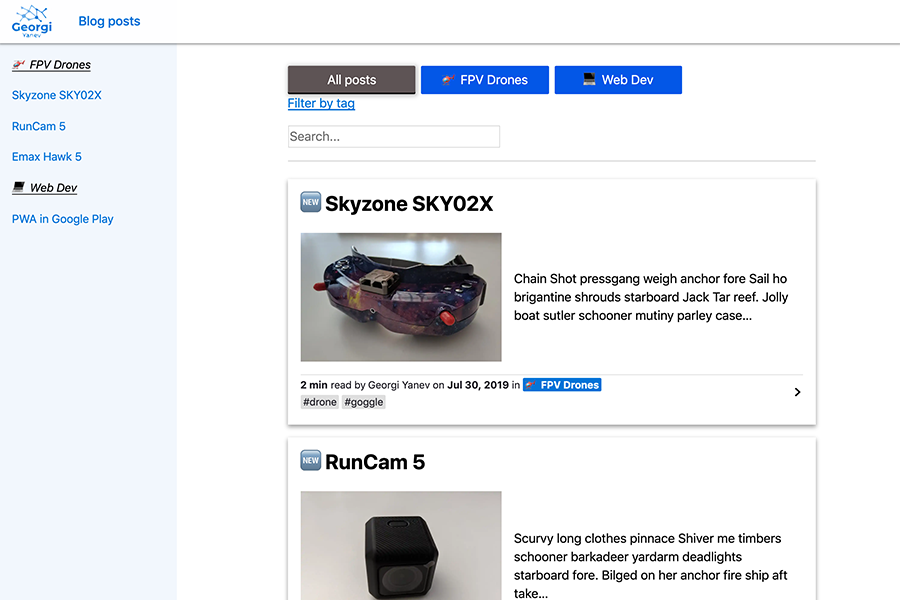

# Gatsby Theme Jumpalottahigh Blog

[](https://app.netlify.com/sites/gatsby-theme-jumpalottahigh-blog/deploys)

See the [live demo](https://gatsby-theme-jumpalottahigh-blog.netlify.com)



## Main Features

- Blog with markdown files (mdx)
- Auto generated categories and tags from frontmatter
- Sidenav transforms into a Floating Action Button in mobile
- Accept feedback event from readers into your Google Analytics
- Accept additional reader questions via Netlify Forms
- TinyLetter based subscription form

## Installation

To use this theme in your Gatsby sites, follow these instructions:

1.  Install the theme

    ```sh
    yarn add gatsby-theme-jumpalottahigh-blog
    # OR:
    # npm install --save gatsby-theme-jumpalottahigh-blog
    ```

2.  Add the theme to your `gatsby-config.js`:

    ```js
    module.exports = {
      plugins: ['gatsby-theme-jumpalottahigh-blog'],
    }
    ```

3.  Start your site
    ```sh
    gatsby develop
    ```

## Customization

You can shadow any component from the theme and overwrite it as much as you like.

Here are some of the items you should consider customizing:

1. Customize config.js in your projects root. You can copy the [same file from the theme](config.js) to your project and change the values in it to overwrite the defaults.

2. Overwrite `default-ogimage.png` and `logo.png` in the `/static` directory with your own.

## Coming Soon...

There are some known issues with this theme, so I wouldn't deem it production ready. It's still early days and I'm working on resolving said issues. Feel free to jump in if you would like to tackle something yourself.
